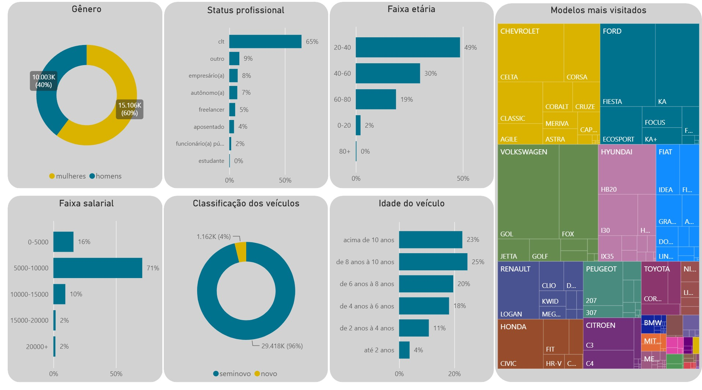

# 🚗 Análise de Perfil de Cliente — Concessionária (Power BI)

Segundo projeto final do curso [SQL para Análise de Dados](https://www.udemy.com/course/sql-para-analise-de-dados/) (Udemy). O objetivo original era construir o dashboard no Excel; optei por refazer a análise completa no **Power BI**.



🔗 O arquivo `.pbix` está disponível neste repositório — abra no Power BI Desktop (gratuito) para explorar o dashboard.

> **Nota:** os gráficos não possuem correlação entre si (cross-filtering), pois cada um foi construído a partir de queries SQL independentes, que já retornavam os dados agregados prontos para cada visual — seguindo a estrutura proposta no curso.

## Objetivo do projeto

Analisar o perfil dos leads de uma concessionária de veículos a partir da base de dados do curso, identificando padrões de compra, características demográficas e comportamento de consumo.


## Fonte dos dados

Base de dados de uma concessionária de veículos do curso

## O que foi feito

1. **Extração e tratamento dos dados via SQL**
   As queries utilizadas para extrair e tratar os dados estão em [`/sql/queries.sql`](./sql/queries.sql).

2. **Modelagem no Power BI**
   Diferente de um modelo relacional tradicional, os dados foram preparados previamente via queries SQL individuais, cada uma já retornando o resultado agregado necessário para um gráfico específico (ex: contagem de clientes por gênero, por status profissional, por faixa etária). Os resultados dessas queries foram exportados para uma planilha Excel, com uma aba/tabela por consulta, e importados diretamente no Power BI.
   Como cada tabela já representa uma visão consolidada e independente, não há relacionamentos entre elas dentro do modelo — cada uma alimenta seu respectivo visual de forma isolada. Essa abordagem concentra o tratamento e a agregação dos dados na camada SQL, deixando o Power BI responsável apenas pela visualização.


3. **Construção dos visuais**
   Foi feito um dashboard baseado com gráfico de gênero, status profissional, faixa etária, faixa salarial, classicação dos veículos, idade do veículo e modelos mais visitados.

## Principais insights

- Insight 1 — O gênero feminino visita mais o site.
- Insight 2 — O 'CLT' é responsavel pelo maior numero de visita.
- Insight 3 — A idade é da faixa etária entre 20-40.
- Insight 4 — Que possuem a renda salarial entre 5000 - 10000.
- Insight 5 — Visualizam carros mais seminovos, dentre eles os que possuem idade de 8-10.
- Insight 6 — E os modelos mais visualizados sao Chevrolet, Ford e Volkswagen.

## Diferencial em relação ao projeto original do curso

O curso ensinava a montagem da análise em Excel. Refiz o projeto do zero em Power BI, com modelagem relacional, medidas DAX e recursos de interatividade não presentes na versão original.

## Estrutura da pasta

```
perfil-cliente/
├── README.md
├── analise-leads.pbix
├── /sql
│   └── queries.sql
└── /screenshots
    ├── perfil-leads.jpg
```

## Tecnologias

- SQL
- Power BI 
