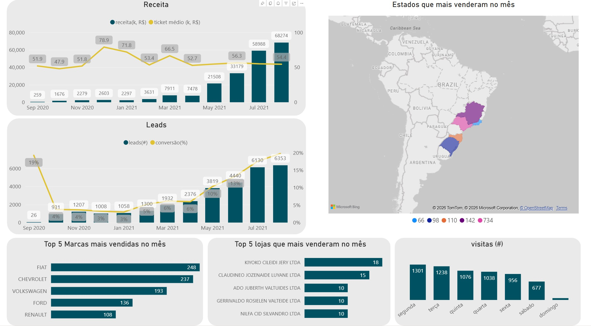

# 📊 Dashboard de Vendas — Power BI

Projeto final do curso [SQL para Análise de Dados](https://www.udemy.com/course/sql-para-analise-de-dados/) (Udemy). O objetivo original do curso era construir o dashboard no Excel; optei por refazer a solução completa no **Power BI**, desde a modelagem dos dados até a construção visual.



🔗 **[Ver dashboard interativo no Power BI Service](#)** ← *substitua pelo link de compartilhamento gerado no Power BI Service*

## Objetivo do projeto

[Descreva em 2-3 linhas o que o dashboard analisa — ex: "Acompanhar a evolução de vendas ao longo do tempo, identificar os produtos/vendedores/regiões com melhor desempenho e apoiar decisões comerciais."]

## Fonte dos dados

[Verificar a relação entre a data, receitas e os leads, além de verifiar os estados que mais vende e os top 5 de marcas que vendem, lojas também, e as visitas pelos dias da semana]

## O que foi feito

1. **Extração e tratamento dos dados via SQL**
   As queries utilizadas para extrair e tratar os dados estão em [`/sql/queries.sql`](./sql/queries.sql).

2. **Modelagem no Power BI**
   [Diferente de um modelo relacional tradicional, os dados foram preparados previamente via queries SQL individuais, cada uma já retornando o resultado agregado necessário para um gráfico específico (ex: contagem de clientes por gênero, por status profissional, por faixa etária). Os resultados dessas queries foram exportados para uma planilha Excel, com uma aba/tabela por consulta, e importados diretamente no Power BI.
   Como cada tabela já representa uma visão consolidada e independente, não há relacionamentos entre elas dentro do modelo — cada uma alimenta seu respectivo visual de forma isolada. Essa abordagem concentra o tratamento e a agregação dos dados na camada SQL, deixando o Power BI responsável apenas pela visualização.]


3. **Construção dos visuais**
   [Foi feito um dashboard baseado com gráfico de gênero, status profissional, faixa etária, faixa salarial, classicação dos veículos, idade do veículo e modelos mais visitados.]

## Principais insights

- [Insight 1 — ex: "O trimestre X apresentou o maior volume de vendas do período analisado."]
- [Insight 2]
- [Insight 3]

## Diferencial em relação ao projeto original do curso

O curso ensinava a montagem do dashboard em Excel. Refiz o projeto do zero em Power BI, aplicando modelagem relacional, medidas DAX e recursos de interatividade (filtros, drill-down) não presentes na versão original.

## Estrutura da pasta

```
dashboard-vendas/
├── README.md
├── dashboard-vendas.pbix
├── /sql
│   └── queries.sql
└── /screenshots
    ├── overview.png
    └── demo.gif
```

## Tecnologias

- SQL
- Power BI (Power Query, modelagem de dados, DAX)
